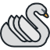

#  Swan

A set of C++ modules that provide some high-level features not available in the C++ Standard Library.

It can work with STL, or if you define `SWAN_NO_STL`, custom `std::string` and `std::vector` implementations with a minimal subset of their equivalent STL classes are provided.

Modern C++ support (11 and upwards) is not required but recommended.

## Features

Swan contains the following modules:

* **console**: Console printing and input handling *(similar functionality to this module can be found in `<iostream>`, bit is provided in case you don't want to use the standard libraries)*.
* **dir**: Directory manipulation. It can list dir contents, change the active directory, and create and delete directories *(the functionality of this module is now part of the standard on `std::filesystem`)*.
* **file**: Reading and writing of binary files. It can also get file properties like size and type *(this module is mostly an alternative to `std::ifstream` and `std::ofstream`; the additional features are now on `std::filesystem`)*.
* **math3d**: Provides `vec2_t`, `vec3_t`, `vec4_t`, `quat_t` and `mat4_t` classes, userful for 3D programming. Operates in radians.
* **platform**: For accesing some platform features, like getting the platform type, launching a program, etc.
* **sharedlib**: Access to dynamically linked libraries.
* **string**: When compiled with `SWAN_NO_STL`, provides an implementation of a subset of `std::string` class. Otherwise, just includes `<string>`.
* **strmanip**: Several string manipulation functions that require several statements in STL. For example, reading a text file into a string (or saving a string to a file), converting a string to a number, splitting a string with a separator token...
* **testing**: Easy to use unit testing module.
* **time**: Time related functions *(the functionality of this module is now part of the standard on `std::chrono`)*.
* **vector**: When compiled with `SWAN_NO_STL`, provides an implementation of a subset of `std::vector` class. Otherwise, just includes `<vector>`.

## Usage

Each of the modules is a self contained file that can be included in your project, by copying the file directly or by adding Swan to your include paths.

Every module is contained within the `swan` namespace, except for `string` and `vector`, which are defined in the `std` namespace for compatibility with their respective STL classes. Some modules provide additional namespaces nested within `swan`.

Please check the **tests** folder for help on how to use the modules. The folder contains a program that performs unit testing on several modules of the library. Proper documentation of the classes will come in the future.

Icons made by [Freepic](http://www.freepik.com) from [www.flaticon.com](https://www.flaticon.com/) is licensed by [Creative Commons BY 3.0](http://creativecommons.org/licenses/by/3.0/).
